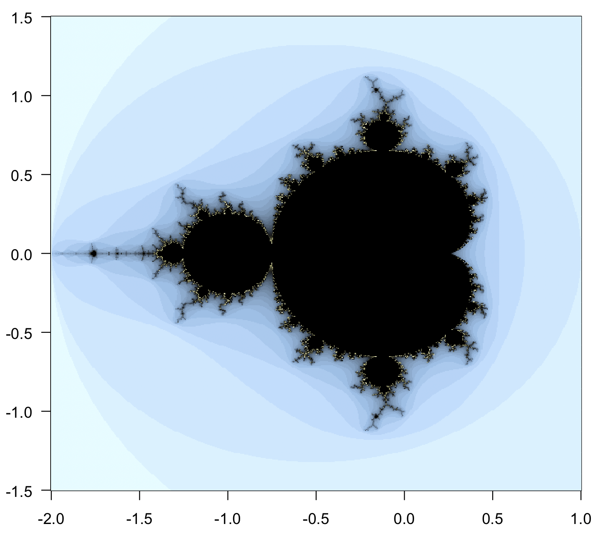

# Fractal

An R package to calculate the Mandelbrot set and the logistic growth. The function that calculates the Mandelbrot set is written in C, and so it is very fast.

If you have the devtools package installed (and if you have set up an appropriate C compiler), you can install the package by typing in the R command prompt

~~~
> devtools::install_github ("mariodosreis/fractal")
~~~

# Examples

Plot the Mandelbrot set

~~~
n <- 40
z <- fractal::mandelbrot(iter=n)
par(pty="s")
image(z, col=c(hcl.colors(n=100, pal="Lisbon"), "black"), las=1)
~~~

Plot the logistic growth

~~~
logistic(div=4000, k=128)
~~~

